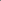
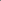
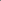
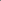
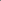

.. _gui-tour:

===============================
GUI Guided Tour
===============================

SpectraPyle provides a browser-based graphical interface built with `Voilà <https://voila.readthedocs.io/>`_ and `ipywidgets <https://ipywidgets.readthedocs.io/>`_, making it easy to configure and run spectral stacking analyses without writing YAML. The GUI is fully integrated with the configuration schema (see :doc:`api/schema`) and enforces the same validation rules as the command-line interface.

**Launching the GUI**

To start the SpectraPyle GUI, run:

.. code-block:: bash

   python project_root/notebooks/run_spectraPyle.py

This launches a local Voilà server and opens your default web browser to the configuration builder. The notebook is backed by :file:`notebooks/make_config.ipynb`, which dynamically renders widgets for all configuration parameters.

---

Launching the GUI
=================

When you first open the SpectraPyle GUI, you will see a layout with several key regions:

   *Figure 1: The SpectraPyle GUI layout, featuring the "Load Existing Config" section at the top, tabbed parameter panels in the center, and the "Run" and "Export Config" buttons at the bottom.*

The GUI is organized as follows:

- **Top Section**: A "Load Existing Config" file browser. Use this to upload an existing YAML or JSON configuration file to pre-populate all widgets. Alternatively, leave it empty and build your config from scratch.

- **Tabbed Panels**: Four main tabs organize configuration parameters:

  1. **Instrument** — Select your survey, instrument, grisms, and data release
  2. **Input/Output** — Choose your catalogue and spectra locations, set output directory
  3. **Catalogue** — Define ID, redshift, and metadata column mappings
  4. **Stack Parameters** — Specify redshift, normalization, resampling, and cosmology

- **Bottom Section**: Two action buttons:

  - **Run** — Validates your configuration and executes the stacking pipeline
  - **Export Config** — Generates a YAML file of your current settings (useful for command-line re-runs or archival)

---

Instrument Tab
==============

The **Instrument** tab lets you select the survey, instrument type, and associated data release.

   *Figure 2: The Instrument tab allows you to select Euclid NISP or DESI, choose grisms, and specify the data release.*

Key controls in this tab:

- **Instrument Dropdown**: Select your instrument. Supported options are:

  - ``Euclid NISP`` (grisms: ``red``, ``blue``, or both)
  - ``DESI`` (grism: ``merged``)

  See :mod:`~spectraPyle.instruments.euclid` and :mod:`~spectraPyle.instruments.desi` for instrument-specific implementation details.

- **Survey Dropdown**: When available, select your survey (e.g., ``Euclid Flagship``, ``DESI Bright Time``). This controls available data releases and QC defaults.

- **Grisms Selector**: For multi-grism surveys (Euclid), choose which grisms to include in the stack. For each selected grism, you must provide input spectra in the "Input/Output" tab.

- **Data Release Dropdown**: Select the spectral data version. Each data release may have different file naming conventions and directory structures, all resolved automatically via :file:`instruments/_resolve_filepath()`.

- **Advanced: Quality Control Section** (collapsible): Fine-tune per-wavelength quality thresholds, dispersion limits, and other QC parameters. These are pre-populated from :file:`instruments/instruments_rules.json` but can be overridden.

---

Input/Output Tab
================

The **Input/Output** tab configures where the pipeline finds your spectra and where to save the stacked output.

   *Figure 3: The Input/Output tab for selecting catalogues, spectra directories, and output paths.*

Key controls in this tab:

- **Catalogue Browser**: Select a FITS, NPZ, or CSV file containing your object catalogue. The pipeline will read columns for object IDs, redshifts, and optional metadata from this file.

- **Spectra Format Selector**: Choose how individual spectra are organized:

  1. **Individual FITS** — One FITS file per object, resolved by object ID (e.g., ``galaxy_00012345.fits``)
  2. **Combined FITS** — All spectra in a single FITS file, indexed by HDU or row number
  3. **Metadata Path** — Path/filename/index sourced from catalogue columns (most flexible)

- **Per-Grism Spectra Directories**: For each grism you selected in the Instrument tab, specify a directory containing spectra files. The pipeline will recursively search these directories for matching filenames.

- **Output Directory**: Specify where the final stacked FITS file should be saved. The filename is auto-generated from your config (see :mod:`~spectraPyle.io.filename_builder`).

---

Catalogue Tab
=============

The **Catalogue** tab defines how the pipeline interprets your catalogue file and extracts key columns.

   *Figure 4: The Catalogue tab for mapping object ID, redshift, and metadata columns.*

Key controls in this tab:

- **ID Column**: The name of the catalogue column containing unique object identifiers (e.g., ``id``, ``gal_id``, ``object_id``). This is used to locate individual spectrum files.

- **Redshift Column**: The name of the catalogue column containing object redshifts (e.g., ``z``, ``redshift``, ``z_spec``). All spectra are shifted to rest-frame using these values.

- **Metadata Columns** (optional): If you want to include metadata (e.g., magnitude, stellar mass, star-formation rate) in the output FITS header or for custom weighting, list the column names here. These are written to the output HDU for reference.

- **Galactic Extinction Correction**: Toggle to apply Galactic dust extinction correction (via `dust_extinction <https://dust-extinction.readthedocs.io/>`_). Choose a model (e.g., ``F19`` for Fitzpatrick 2019). The pipeline estimates extinction from object coordinates if available.

- **Custom Normalization Column** (optional): If you have pre-computed normalization factors in your catalogue (e.g., continuum flux), specify the column name here to use it in the "Francis 1991 Template Normalization" mode (see :doc:`normalization`).

---

Stack Parameters Tab
====================

The **Stack Parameters** tab groups all stacking-specific settings: redshift handling, normalization, resampling, wavelength range, and cosmology.

   *Figure 5: The Stack Parameters tab for configuring redshift, normalization, resampling, wavelength range, and cosmological parameters.*

This tab is organized into five collapsible sections:

**Redshift** (6 choices)
  Choose how spectra are shifted to a common rest-frame:

  - **Fixed Redshift** — Assume all objects have the same redshift (useful for strong lensing stacks)
  - **Catalogue Redshift** — Use the redshift column from your catalogue (most common)
  - **Catalogue Redshift (Error-Weighted)** — Weight shifts by the inverse of redshift errors (if available)
  - **Photometric Redshift** — Use a photometric redshift column instead of spectroscopic
  - **Best Available** — Prefer spectroscopic; fall back to photometric if needed
  - **Custom Column** — Use any other catalogue column for redshifts

**Normalization** (link to :doc:`normalization`)
  Choose the normalization strategy:

  - **None** — No normalization; use raw fluxes
  - **Median** — Normalize each spectrum to its median flux
  - **Mean** — Normalize each spectrum to its mean flux
  - **Continuum (Spline)** — Fit a cubic spline to the continuum and divide it out
  - **Continuum (Polynomial)** — Fit a polynomial continuum model
  - **Francis 1991 Template** — Normalize using a template spectrum (requires a template file and optional custom column)

**Resampling** (link to :doc:`resampling`)
  Define the rest-frame wavelength grid:

  - **Grid Type** — Linear, logarithmic, or use a reference spectrum's grid
  - **Grid Spacing** — For linear grids, specify Angstrom/pixel; for log grids, specify km/s/pixel
  - **Velocity Sampling** — Alternative to linear spacing; specify km/s per pixel

**Wavelength Range**
  - **Wavelength Min / Max** — Set the rest-frame wavelength bounds (in Angstrom). Spectra are clipped to this range.
  - **Auto-Detect** — The GUI can infer sensible defaults from your instrument and data release.

**Performance & Cosmology**
  - **Chunk Size** — Number of spectra to process per batch (default: 500). Increase for faster processing (more memory) or decrease for tight memory constraints.
  - **Number of Processes** — Parallelization level for multi-core processing (default: all available cores).
  - **Cosmology Preset** — Choose a pre-defined cosmology (Planck 2018, LCDM, etc.) or specify custom H0, Omega_m, Omega_lambda, and w0.
  - **Sigma-Clipping** (collapsible): Configure outlier rejection—specify sigma threshold, clipping mode (lower, upper, both), and iteration limit.
  - **Bootstrap Uncertainty** (collapsible): Enable bootstrap resampling to estimate error bars on the stacked spectrum.

---

Running Your Stack
==================

Once all parameters are configured:

1. Review your settings across all tabs.
2. Click the **Run** button at the bottom of the GUI.
3. The pipeline will validate your configuration, check file access, and begin processing.
4. Progress updates appear in the notebook cell output (number of spectra processed, stacking stage).
5. When complete, the final stacked FITS file is written to your specified output directory.

**Exporting Your Config**

At any time, click **Export Config** to download a YAML file of your current settings. This file can be:

- Archived alongside your final stacked spectrum
- Used to re-run the same analysis from the CLI using ``python stacking.py --config exported.yaml``
- Shared with collaborators or included in supplementary materials

---

References
==========

For more details on configuration and parameters, see:

- :doc:`api/schema` — Full configuration reference (Pydantic models)
- :doc:`normalization` — Detailed explanation of normalization modes
- :doc:`resampling` — Wavelength grid and resampling strategies
- :doc:`quickstart` — CLI-based stacking workflow and GUI usage
